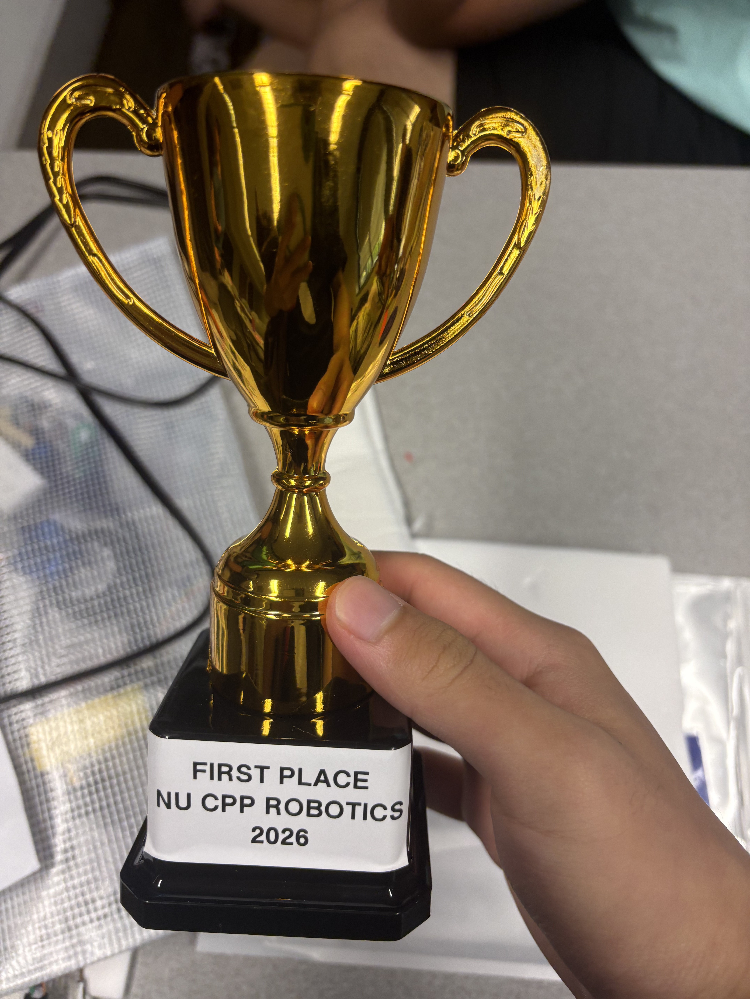
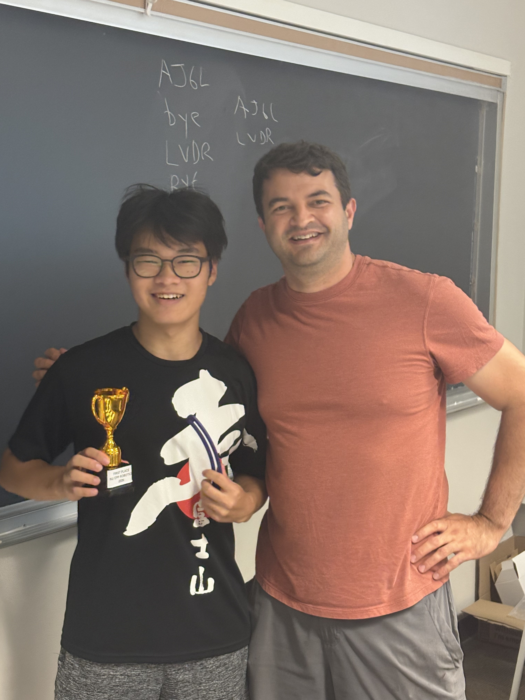

# Northwestern Session 2 - Mechatronics Competition Robot

Competition robot I designed and built for a block-sorting challenge at Northwestern's Mechatronics program (July 2026). Placed 1st out of 30+ students, judged by Professor Marchuk.

**CAD:** [View the full design on OnShape](https://cad.onshape.com/documents/bd7bf225d3cd60975be912fb/w/9dfe725a6ceab4a6fb9d2f20/e/50ae594808063be0acbd73b2?renderMode=0&uiState=6a5fcf8d376c3db27cd99228)

  
  

## Overview

The robot drives itself around the competition area, uses an ultrasonic sensor and a limit switch to know when it's about to hit something, and picks up blocks with a claw. It figures out where to put each block by checking how bright the surface underneath it is.

## Key Design Decisions

**Claw instead of ram-pushing.** Most people building this just pushed blocks around with a ram. I wanted something that actually grabbed the block, more contact means the placement doesn't slip or drift the way pushing does. The full claw geometry is in the [CAD model](https://cad.onshape.com/documents/bd7bf225d3cd60975be912fb/w/9dfe725a6ceab4a6fb9d2f20/e/50ae594808063be0acbd73b2?renderMode=0&uiState=6a5fcf8d376c3db27cd99228) if you want to see how it's put together.

**Reading brightness instead of "color."** The sensor is really just an LED and a phototransistor, it shines light down and reads what bounces back. Light blocks and dark blocks come back with noticeably different readings, so that's all I needed to sort them.

**Driving straight without a steering system.** The robot had a natural pull to one side and I didn't want to write correction logic for it. Instead I just tuned the motor duty cycles by hand until it drove straight on its own. Simpler fix, same result.

## Hardware

- Raspberry Pi Pico — the brain
- 2x DC motors, PWM controlled
- 2x servos, running the claw
- HC-SR04 ultrasonic distance sensor
- Analog light sensor for ambient reference
- Analog reflectance sensor for reading block brightness
- Limit switch for detecting walls

## Design Log

`Damon's Design Log.pdf` in this repo has the actual day-by-day process, July 6 to July 17. Early sketches, breadboard photos as things got added, and the code at every stage, not just the final version. It's the messier version of this story, dead ends and all, if you want to see how it actually came together instead of just the end result.

## Repo Structure

This isn't just the final robot's code, it's the whole build, from the first tiny test to the finished thing:

| File | Description |
|---|---|
| `cipher.py` | Caesar cipher encrypt/decrypt — an early warm-up |
| `morse_flasher.py` | Blinks a message in Morse code with an LED |
| `button_led_toggle.py` | First input/output test, an LED controlled by a button |
| `button_counter.py` | Counts button presses |
| `potentiometer_dimmer.py` | A knob controls LED brightness |
| `light_sensor_reader.py` | Reads and prints ambient light level |
| `distance_light_reader.py` | Distance and light sensors running together |
| `servo_follows_distance.py` | Servo angle tracks live distance readings |
| `motor_servo_test_rig.py` | First time motors, claw, and sensors ran together |
| `nav_prelim_limit_switch.py` | Early navigation: drive, hit a wall, turn |
| `block_color_sensor.py` | Tells light blocks from dark ones using the reflectance sensor |
| `competition_robot_final.py` | The actual competition code: navigation, claw, wall detection |

## From Practice to Final Product

None of this came together in one sitting. It was a stack of small tests, and each one worked out a specific problem before it became part of something bigger.

The button and potentiometer tests were the first time I touched digital and analog input on the Pico. That same analog-reading logic shows up again in `light_sensor_reader.py`, and eventually in `block_color_sensor.py` — reading a raw value and turning it into a usable threshold is basically the same trick whether it's controlling brightness or sorting a block.

`distance_light_reader.py` and `servo_follows_distance.py` were where I learned to read a sensor and react to it in real time, before any of that touched a motor. So by the time I got to `motor_servo_test_rig.py`, I already trusted the sensor readings and could just focus on getting the motors and claw working right.

`nav_prelim_limit_switch.py` is where the actual navigation started to take shape: drive, hit something, react. It was rough, the timing was off in places, but it proved the core loop actually worked before I stacked the claw and sorting logic on top.

By the time I got to `competition_robot_final.py`, most of the hard problems were already solved on their own. I wasn't debugging sensors, motors, and navigation all at once anymore, I was just putting together pieces I already trusted, all mapped out in the [CAD assembly](https://cad.onshape.com/documents/bd7bf225d3cd60975be912fb/w/9dfe725a6ceab4a6fb9d2f20/e/50ae594808063be0acbd73b2?renderMode=0&uiState=6a5fcf8d376c3db27cd99228). What was left was just making sure none of those pieces stepped on each other once they were all running at the same time. Building it this way is a big part of why it didn't fall apart the second something unexpected happened during the actual competition.

## Biggest Challenge

Honestly, just keeping track of everything at once. Motors, two servos, three different sensors, and the navigation logic all had to run together without fighting each other or timing out, and most of the debugging was just figuring out which piece was actually the problem when something broke.
